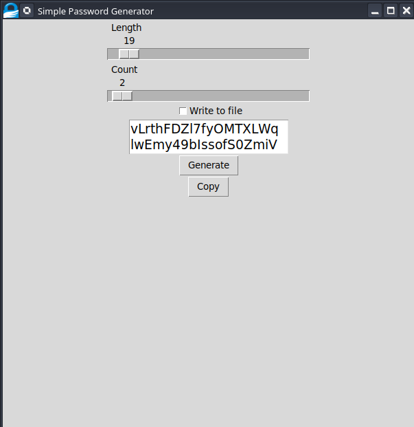

# 🐍 PassGPY — Password Generator made in Python

---
A very simple and minimal password generator CLI Program made using [Typer](https://github.com/fastapi/typer)

---

# 🚀 Installation

This program is available as a docker image on [Github Container Registry](https://github.com/iaguinho1727/PassGPy/pkgs/container/passgpy) 
and on [PyPi](https://pypi.org/project/passgpy/).

Docker:
1. `docker run --rm -it  ghcr.io/iaguinho1727/passgpy generate`

Pip:

1. `pip install passg`
2. `python -m passg generate`

# 💻 Usage

Custom Length:

`python -m passg generate --length 50`

Write to a file:

`python -m passg generate --output passwords.txt`

Multiple passwords:

`python -m passg generate --count 10`

# 💄 GUI Mode

A graphical user interface is also available. You can launch it with:

`python -m passg gui`

Using the GUI with Docker:

`docker run --rm -e DISPLAY=$DISPLAY -v /tmp/.X11-unix:/tmp/.X11-unix:ro -it ghcr.io/iaguinho1727/passgpy:0.0.1 gui`

